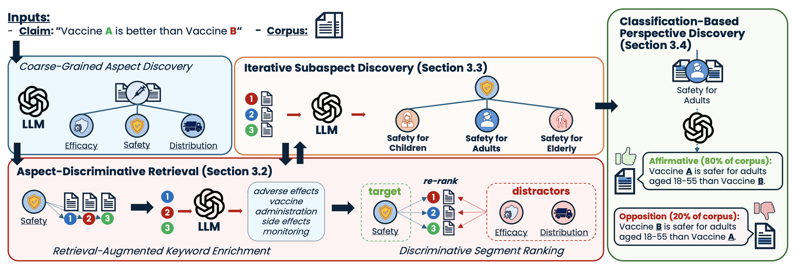

# Official Repo of ClaimSpect


Official implementation for paper [Beyond True or False: Retrieval-Augmented Hierarchical Analysis of Nuanced Claims](https://openreview.net/forum?id=6Io5Pmuh19).

## Citations
Please cite the paper and star this repo if you use ClaimSpect and find it interesting/useful, thanks! Feel free to open an issue if you have any questions.

```bibtex
@inproceedings{
    anonymous2025beyond,
    title={Beyond True or False: Retrieval-Augmented Hierarchical Analysis of Nuanced Claims},
    author={Anonymous},
    booktitle={Submitted to ACL Rolling Review - February 2025},
    year={2025},
    url={https://openreview.net/forum?id=6Io5Pmuh19},
    note={under review}
}
```